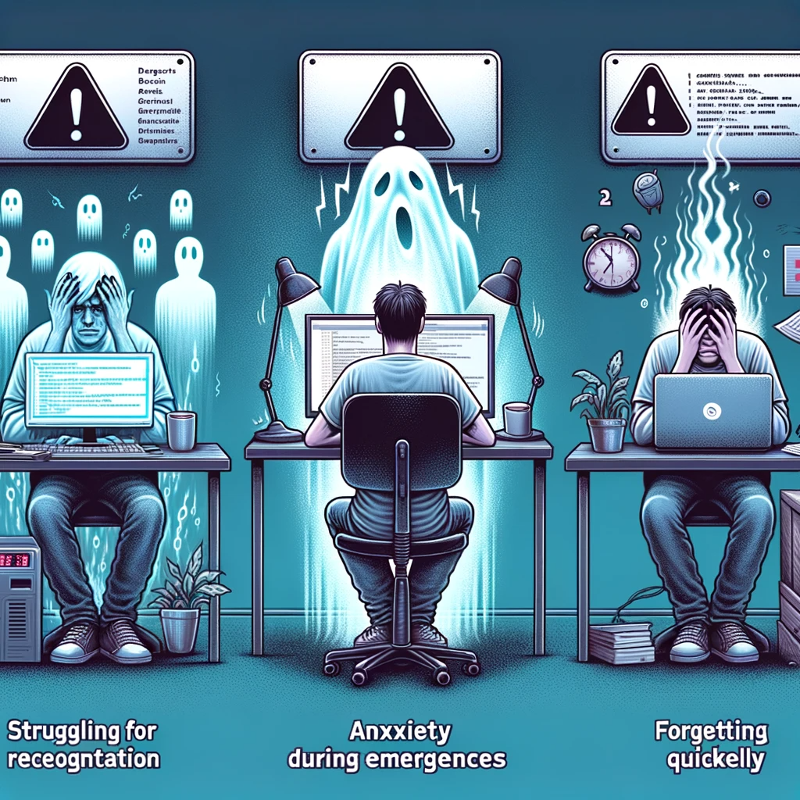

# 意外事件助推避坑（Unplanned Event Nudged Pitfall Avoidance）

> 做软件的人：“工作体验好，好事才能来。”

## 我是谁

* 吾真本，本名伍斌。独立软件开发咨询师。
* 很多人**35岁**不写代码，我**53岁**仍在享受写代码，测试，咨询。
* 2021年开始涉足混沌工程咨询，曾为某金融公司的运维部门，成功交付混沌工程咨询服务，成为Thoughtworks公司中国区首批交付混沌工程咨询项目的咨询师。
* “吾真本说混沌工程”知乎专栏主。
* 专注“**意外事件助推避坑**”与混沌工程咨询与培训。
* 翻译《发布！（第2版）》，合译《混沌工程》。
* 作为看到IT系统生产意外事件，就有如何助推避坑冲动的混沌工程迷，我这几年研究了不少“意外事件助推避坑”案例。在这里想和大家分享我这几年“意外事件助推避坑”与混沌工程实践的经验。干货如下.

## 本项目的目的

1. 解释“意外事件助推避坑”的why, what和how

2. 按照意外事件发生顺序，列出国内外各大互联网公司的意外事件的关键信息，以便用于“意外事件助推避坑”时参考。

  * 关键信息包括：

    * 起始时间
    * 持续时长
    * 官方复盘报告链接
    * 影响范围
    * 事件简介
    * 恢复过程
    * 官方报告触发因素
    * 改进措施
    * 出错界面截屏markdown文件链接

  * 欢迎各位混沌粉儿fork本项目，并提pull request。
  * 为保持本页面的简洁，如果想提交某次意外事件的出错界面截屏，每位混沌粉儿请在`screenshots`文件夹里，各自创建一个新文件夹，来容纳出错页面截屏以及相关的markdown文件。文件夹的命名规则为`<yyyy-mm-dd>-<产品名>-<你的昵称>`。比如，如果我想为滴滴崩了提供一个出错界面截屏，那么我会在`screenshots`文件夹里，创建一个名为`2023-11-27-didi-wuzhenben`的文件夹，然后在里面存放相关的截屏文件和markdown文件。然后再将其加入本`README.md`文件即可。

## 当前生产事故复盘实践的三大缺点

1. **复盘报告分享难**：生产意外事件复盘报告一般仅供IT团队相关少数几人阅读，使得企业大部分做软件的人不了解以往生产意外事件所揭示的避坑要点，增大了重蹈覆辙的风险，导致再次踩坑；

2. **演练考试非考验**：仅针对运维部门感兴趣的基础设施层的意外事件（如CPU/内存/磁盘/进程/服务/主机等事件）进行演练，而忽视因程序bug所导致的意外事件演练。当在现实中真正遇到后者，由于缺乏演练，忙乱中难以做出正确判断和行动；

3. **缺乏亲身体验感**：仅阅读复盘报告，难以亲身体会意外事件发生场景，容易忽视之前所发现过的陷阱。

## 三大缺点给做软件的人所带来的三大痛点

1. **难被认可**

> “不出问题，不懂的人不知道你做了什么。”
>
> “出了问题，就生气指责你到底做了什么。”（复盘报告分享难）；

2. **心里发虚**

* 意外事件抢修中由于缺乏演练心发虚（演练考试非考验）；

3. **很快遗忘**

* 读完意外事件复盘没有实操很快就忘（缺乏亲身体验感）。

图 三大缺点给做软件的人所带来的三大痛点：难被认可、心里发虚、很快遗忘

## “意外事件助推避坑”四大价值点

1. **领导更认可**

* 将避坑指南写得利他且易懂以提升稳定性保障领导认可度；

2.  **更多人学到**

* 将生产事故复盘改名为避坑指南以方便扩大分享学习范围；

3. **练过心不慌**

* 练过各方重视的停机长和损失大的意外事件后遇事则不慌；

4. **印象更深刻**

* 避坑指南与定期演练相配套以让已发现陷阱印象生动深刻。

## 什么是“意外事件助推避坑”？

* **什么是“事件”？**

  * 事件指导致系统不可用或离线的特定事情的发生。包括计划外事件和计划内事件。
  
  * 意外事件指计划外事件。

* **什么是“助推”？**

  * **助推**指营造**容许自由选择**的温和环境，引导人们从意外事件中体验到避坑要点，从而印象深刻，有助于避免重蹈覆辙。比如将“生产事故复盘”改名为“意外事件避坑指南”以方便扩大分享学习范围。

* “意外事件助推避坑”与“生产事故复盘”有什么**区别**？

  - 从使用软件的用户和做软件的人的**体验**出发：

    * 使用软件的用户：用户体验好，好事才能来。

    * 做软件的人：工作体验好，好事才能来。

    * 以使用软件的用户和做软件的人的视角，进行叙事。

  - **温和而不含指责**意味

    * 将“生产事故”这样的带有指责意味的负面用语，替换为“意外事件”这样温和的用语，同时将“复盘”替换为“避坑”，能将意外事件当事人的**自责自保**心态，转变为**利他分享**心态，促进高质量的避坑指南的产生、分享与演练，有助将来避坑。

  - **助推而非强推**

    * 强推指强制性的推动，不容许自由选择。这容易引起反感，导致避坑指南的产生与分享质量低下。
    
    * 社会心理学的自我决定理论认为，人有**3个基本需求**：**自主做出决策、自我能力提升、良好人际关系**。
    
    * 助推有助于满足人的上述3个基本需求。而强推则让人的上述需求长期得不到满足，必然得不到好结果。

## “意外事件助推避坑”的原则

> 预防虽重要，难免遇意外。
> **修复意外时，系统仍可用**。
> 不去指责人，实操印象深。
> 利他且易懂，领导更认可。

## “意外事件助推避坑”的步骤

1. 识别意外事件点
2. **隔离**意外事件点
3. **替换**意外事件点
4. **避坑**意外事件点
5. 演练意外事件点

> 业界普遍缺乏“可隔离”、“可替换”和“可避坑”这三种有助快速修复的思维。

## 国内外各大互联网公司的意外事件的关键信息

| 起始时间（从新到旧） | 持续时长（小时） | 官方复盘报告链接 | 影响范围 | 事件简介 | 恢复过程 | 官方报告触发因素 | 改进措施 | 出错界面截屏markdown文件链接 |
| :---: | :---: | :---: | :---: | :---: | :---: | :---: | :---: | :---: |
| 2023.11.27 22:00 | 网约车12；青桔单车18 | [滴滴出行官方微博](https://weibo.com/u/2838754010) | （不详）| （不详）| （不详） | 底层系统软件发生故障 | （不详） | [2023-11-27-didi-wuzhenben](./screenshots/2023-11-27-didi-wuzhenben/screenshots.md) |
| 2023.11.12 17:39 | 1.68 | [阿里云健康状态](https://status.aliyun.com) | OSS、OTS、SLS、MNS等产品的部分服务受到影响，大部分产品如ECS、RDS、网络等运行不受影响。云产品控制台、管控API等功能受到影响 | 北京时间2023年11月12日17:39起，阿里云云产品控制台访问及管控API调用出现异常、部分云产品服务访问异常，工程师排查故障原因与访问密钥服务（AK）异常有关。工程师修订白名单版本后，采取分批重启AK服务的措施，于18:35开始陆续恢复，19:20绝大部分Region产品控制台和管控API恢复。 | 17:39阿里云云产品控制台访问及管控API调用出现异常。17:50工程师确认故障是AK服务异常导致，影响云产品控制台、管控API调用异常，以及依赖AK服务的云产品服务运行异常。18:01工程师定位到根因。18:07开始执行恢复措施，包括修订白名单版本、重启AK服务。18:35杭州等Region开始恢复正常。19:20绝大部分Region的云产品控制台和管控API调用恢复正常。 | 访问密钥服务（AK）在读取白名单数据时出现读取异常，因**处理读取异常的代码存在逻辑缺陷，生成了一份不完整白名单**，导致不在此白名单中的有效请求失败，影响云产品控制台及管控API服务出现异常，同时部分依赖AK服务的产品因不完整的白名单出现部分服务运行异常。 | 增加AK服务白名单生成结果的校验及告警拦截能力。增加AK服务白名单更新的灰度验证逻辑，提前发现异常。增加AK服务白名单的快速恢复能力。加强云产品侧的联动恢复能力。 | [2023-11-12-aliyun-wuzhenben](./screenshots/2023-11-12-aliyun-wuzhenben/screenshots.md) |
| 2023.10.23 14:07 | 8 | [关于语雀 23 日故障的公告](https://mp.weixin.qq.com/s/WFLLU8R4bmiqv6OGa-QMcw) | 大面积的服务中断。千万级客户。 | 10 月 23 日下午，服务语雀的数据存储运维团队在进行升级操作时，由于新的运维升级工具 bug，导致华东地区生产环境存储服务器被误下线。受其影响，语雀数据服务发生严重故障，造成大面积的服务中断。为了尽快恢复服务，我们和数据存储运维团队全力进行数据恢复工作，但受限于恢复方案、数据量级等因素，整体用时较长。 | 14:07 数据存储运维团队收到监控系统报警，定位到原因是存储在升级中因新的运维工具 bug 导致节点机器下线；14:15 联系硬件团队尝试将下线机器重新上线；15:00 确认因存储系统使用的机器类别较老，无法直接操作上线，立即调整恢复方案为从备份系统中恢复存储数据。15:10 开始新建存储系统，从备份中开始恢复数据，由于语雀数据量庞大，此过程历时较长，19 点完成数据恢复；同时为保障数据完整性，在完成恢复后，用时 2 个小时进行数据校验；21 点存储系统通过完整性校验，开始和语雀团队联调，最终在 22 点恢复语雀全部服务。用户所有数据均未丢失。 | 10 月 23 日下午，服务语雀的数据存储运维团队在进行升级操作时，由于**新的运维升级工具 bug，导致华东地区生产环境存储服务器被误下线**。| 通过这次故障我们深刻认识到，语雀作为一款服务千万级客户的文档产品，应该做到更完善的技术风险保障和高可用架构设计，尤其是面向技术变更操作的“可监控，可灰度，可回滚”的系统化建设和流程审计，从同 Region 多副本容灾升级为两地三中心的高可用能力，设计足够的数据和系统冗余实现快速恢复，并进行定期的容灾应急演练。只有这样，才能提升严重基础设施故障时的恢复速度，并从根本上避免这类故障再次出现。为此我们制定了如下改进措施：1、升级硬件版本和机型，实现离线后的快速上线。该措施在本次故障修复中已完成；2、运维团队加强运维工具的质量保障与测试，杜绝此类运维 bug 再次发生；3、缩小运维动作灰度范围，增加灰度时间，提前发现 bug；4、从架构和高可用层面改进服务，为语雀增加存储系统的异地灾备。 | [2023-10-23-yuque-wuzhenben](./screenshots/2023-10-23-yuque-wuzhenben/screenshots.md) |

---
如果你喜欢这篇文章，欢迎点赞和收藏，并转发给身边有需要的人。
如果你有更好的方法，欢迎在留言区留言，和我讨论。

